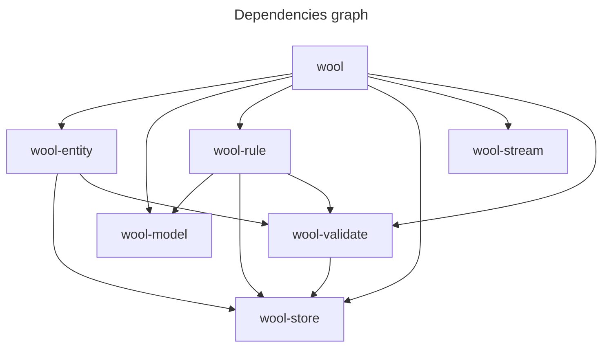

Wool
=

An exploration on Rule-Engine based development, CQRS and EventSourcing.

Work in progress

```mermaid
---
title: Dependencies graph
---
graph TD;

    wool-->wool-entity
    wool-->wool-model
    wool-->wool-rule
    wool-->wool-store
    wool-->wool-stream
    wool-->wool-validate
    
    wool-entity-->wool-store
    wool-entity-->wool-validate

    wool-rule-->wool-model
    wool-rule-->wool-store
    wool-rule-->wool-validate
    
    wool-validate-->wool-store
```
